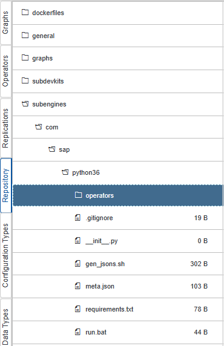
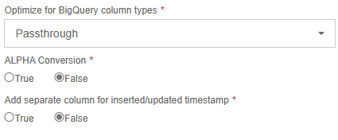
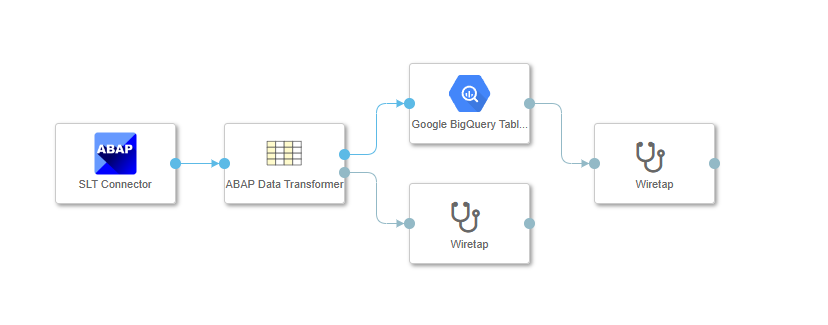

# Replicating data from ECC to Google BigQuery with SAP Data Intelligence

## Description

### Introduction

Many SAP customers have ECC systems with older kernels - missing out the new replication features of SAP Data Intelligence Cloud. This set of operators is handling replication from ECC systems with DMIS 2011 using the "SLT Connector" operator integrating data from SAP Landscape Transformation (SLT) version 2.0

The other main advantage of the provided operators is the possibility to replicate changes in SAP data directly into Google BigQuery tables using the newly announced (April, 2023) CDC capability of BigQuery messaging protocol. This means changes in the ABAP system will be available within minutes in the destination BigQuery tables.

**This repo contains:**
<ul>
    <li>Google Bigquery CDC Writer operator</li>
    <li>Google Bigquery Table Creator operator</li>
    <li>ABAP Data Transformer operator</li>
    <li>Protobuf compiler operator</li>
</ul>

### Setup

To start, we need to ensure our pipeline has the proper dependencies, follow the instructions in the link below to setup our container.

[Dockerfile setup readme](https://github.com/Fylkirist/data-intelligence-slt-to-biqquery-cdc/tree/main/dockerfiles)

Make sure to tag the dockerfile with "bigquery" and pyarrow==12.0.1 so our operators can use it later.

Now download the release here:
[v1.0.0 release download](https://github.com/Fylkirist/data-intelligence-slt-to-biqquery-cdc/releases/tag/v1.0.0)

And import it in this directory in your repository tab:

To import it, right click the "operators" folder and click "import file" then select the tgz file.
Now once you refresh your "operators" tab, they should be available to you.

---

### BigQuery message compiler (protobufs)

Using the compiler in your pipeline is required, it makes starting up a new pipeline or making changes to your table smoother by doing a one time protobuf compilation upon initial load. In order to use it, place it ahead of the CDC writer operator. Connect the SLT connector to the protobuf compiler input and connect the output to the CDC writer, the info port will send the proto schema so you can see it on a wiretap. The protobuf compiler sends a flag in the Message object that tells the CDC writer if the message comes with the bytestring used to encode the protobuf.

---

### Google BigQuery CDC Writer operator

This operator writes to Google bigquery.
To use, you need to select your credentials, then enter the names of your dataset and table you want to update.

### ABAP Data Transformer

This is an operator to sanitize the data before it's parsed and sent to Google BigQuery, for example, bigquery does not allow datestamps to exceed 31. December so invalid timestamps are rewritten from 9999-99-99 to NULL. Place it before the protobuf compiler in the pipeline.

---

### Google BigQuery Table Creator operator

Checks if the table exists and creates it with the proper attributes if not. We recommend creating a separate pipeline to help creating BigQuery tables.

---

### Creating a BigQuery table

To create a BigQuery table that matches data from an SLT connector, use the following pipeline:
1. SLT connector
2. Data Transformer
3. Google BigQuery Table creator

This pipeline will create a new table in your BigQuery project with a schema that matches the input data, do keep in mind that you will need to use the same settings on the data transformer when you are setting up the writer pipeline, since it modifies not just data, but also what data types are written.

---

### Setting up a table writer pipeline

To replicate or stream rows to a Bigquery table, set your pipeline up in the following order:
1. SLT connector
2. Data transformer
3. Google BigQuery message compiler
4. Google BigQuery CDC writer

Make sure the table you are trying to write to exists and has the same schema as the input stream

---

## Performance

The general performance of this replication process is quite fast. However we may improve code to speed up processing.  For the time, the "ABAP Data Transform" operator is using pyarrow libraries. The arrays created by pyarrow can be directly passed to the "Google BigQuery CDC Writer" operator, instead of going by CSV content in the body og the message.

### Conclusion

This package has been developed during a PoC, and have added features as the requirements evolved.  It can easily be extended with more features, since it utilizes the powerful capability of Custom Operators within SAP Data Intelligence Cloud.

## Requirements
SAP Data Intelligence Cloud, DMIS 2011 or newer installed on source system. DMIS must adhere to latest SP available.

## Release

[v1.0.0 release download](https://github.com/Fylkirist/data-intelligence-slt-to-biqquery-cdc/releases/tag/v1.0.0)
