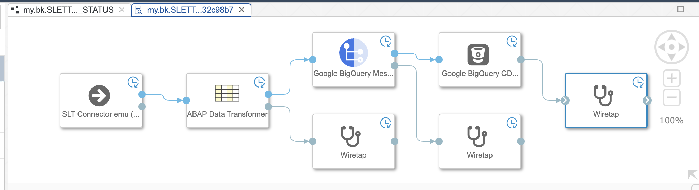
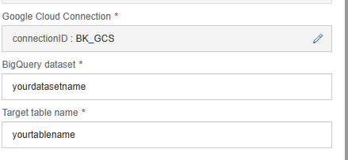
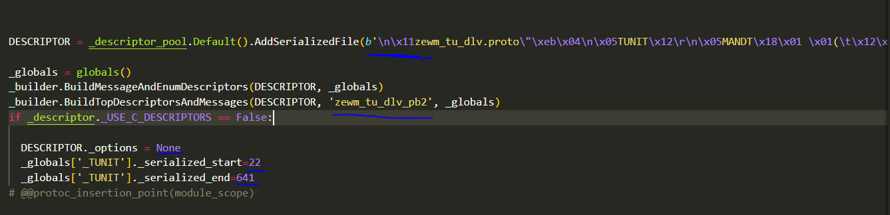

# Replicating data from ECC to Google BigQuery with SAP Data Intelligence

## Description

### Introduction

Many SAP customers have ECC systems with older kernels - missing out the new replication features of SAP Data Intelligence Cloud. This set of operators is handling replication from ECC systems with DMIS 2011 using the "SLT Connector" operator integrating data from SAP Landscape Transformation (SLT) version 2.0

The other main advantage of the provided operators is the possibility to replicate changes in SAP data directly into Google BigQuery tables using the newly announced (April, 2023) CDC capability of BigQuery messaging protocol. This means changes in the ABAP system will be available within minutes in the destination BigQuery tables.


**This repo contains:**
<ul>
    <li>Google Bigquery CDC Writer operator</li>
    <li>Google Bigquery Table Creator operator</li>
    <li>ABAP Data Transformer operator</li>
    <li>Protobuf compiler operator</li>
</ul>


### Setup


To start, we need to ensure our pipeline has the proper dependencies.
Go to your repo and create a new dockerfile that contains the following code: 

    FROM $com.sap.sles.base

    RUN pip install --user google-cloud-bigquery
    RUN pip install --user google-cloud-bigquery-storage
    RUN pip install --user google-cloud-storage
    RUN pip install --user pyarrow==12.0.1

    ENV PROTOC_VERSION=23.4

    RUN curl -L "https://github.com/protocolbuffers/protobuf/releases/download/v${PROTOC_VERSION}/protoc-${PROTOC_VERSION}-linux-x86_64.zip" -o /home/vflow/protoc.zip 
    RUN unzip /home/vflow/protoc.zip -d /home/vflow 
    RUN rm -rf /tmp/vflow/protoc.zip
    

Make sure to tag the dockerfile with "bigquery" and pyarrow==12.0.1 so our operators can use it later.



---

### Protobuf compiler operator

Using the compiler in your pipeline is recommended but not required, it makes starting up a new pipeline or making changes to your table smoother by doing a one time protobuf compilation upon initial load. In order to use it, place it ahead of the CDC writer operator. Connect the SLT connector to the protobuf compiler input and connect the output to the CDC writer, the info port will send the proto schema so you can see it on a wiretap. The protobuf compiler sends a flag in the Message object that tells the CDC writer if the message comes with the bytestring used to encode the protobuf.

---



### Google BigQuery CDC Writer operator

This operator writes to Google bigquery.
To use, you need to select your credentials, then enter the names of your dataset and table you want to update.
If you are manually compiling your protobufs, set "precompiled" to true, and substitute the contents of buffer_dict in the manner described below:

Your message name must be TUNIT in your proto file.
Copy the following from your compiled pb2 file


---

Create a new dictionary entry using the source table name in buffer_dict like so

``` python
buffer_dict = {
    "SOURCETABLE":{
        "bytes":b'your_bytestring_here',
        "start":0,
        "end":0,
        "options":None,
        "topmessage":"message_protobuf_name"
    }
}
```

### ABAP Data Transformer

This is an operator to sanitize the data before it's parsed and sent to Google BigQuery, for example, bigquery does not allow datestamps to exceed 31. December so invalid timestamps are rewritten from 9999-99-99 to NULL. Place it before the protobuf compiler in the pipeline.

---

### Google BigQuery Table Creator operator

Checks if the table exists and creates it with the proper attributes if not. We recommend creating a separate pipeline to help creating BigQuery tables.

---
## Performance

The general performance of this replication process is quite fast. However we may improve code to speed up processing.  For the time, the "ABAP Data Transform" operator is using pyarrow libraries. The arrays created by pyarrow can be directly passed to the "Google BigQuery CDC Writer" operator, instead of going by CSV content in the body og the message.


### Conclusion

This package has been developed during a PoC, and have added features as the requirements evolved.  It can easily be extended with more features, snice it utilize the powerful capability of Custom Operators within SAP Data Intelligence Cloud.

## Requirements
SAP Data Intelligence Cloud, DMIS 2011 or newer installed on source system. DMIS must adhere to latest SP available.


