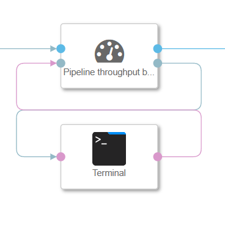

### Throughput benchmarker

This operator measures the data throughput of the pipeline, and outputs an estimate to it's info port.

Supported commands are:

1. "bytes": Arguments are "hour","second","total". Displays the throughput of the operator in bytes.
2. "lines": Arguments are "hour","second","total". Displays the throughput of the operator on the basis of row changes in target database.
2. "iperf": Requires two arguments, server address, and port number. This command tests the target server upload and download speed and is intended to help identify bottlenecks when one can't be found in the graph itself.

This operator is to be placed before any data processing happens, like this:

Ports:
    datain: Takes in the data stream of the graph that you want to track.
    dataout: Outputs the data stream unaltered.
    cmd: Takes commands from a terminal operator.
    info: Outputs the benchmark information when a command is entered.

