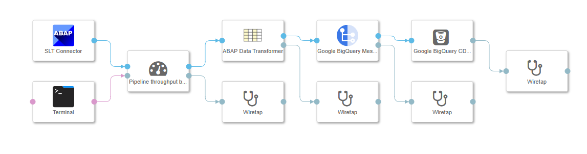

### Throughput benchmarker

This operator measures the data throughput of the pipeline, and outputs an estimate to it's info port.

Supported commands are:

1. hour : displays throughput in KB/h
2. second : displays throughput in KB/s
3. total : displays the total throughput and the time this pipeline instance has been running for

This operator is to be placed before any data processing happens, like this:

